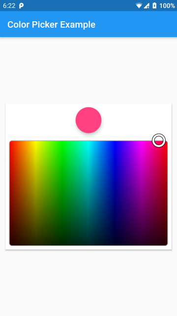

# simple_color_picker

Flutter Package </br>
[](https://pub.dev/packages/simple_color_picker) </br>

A simple HSV color picker without any glitz or glamour. </br>


## Sample



## Installation

```yaml
dependencies:
  simlpe_color_picker: any
```
## Example

```dart
import 'package:simple_color_picker/simple_color_picker.dart';

SimpleColorPicker(
    color: this.color,
    onChanged: (value) =>
         super.setState(() => this.onChanged(value)),
)
```
## Credits

This package is a mutation of 
[flutter_hsvcolor_picker](https://github.com/fluttercandies/flutter_hsvcolor_picker),
a library module containing very complex implementation of HSV color picker.

## Origin

One of my projects had a requirement of showing a simple color picker and I couldn't find any Flutter plugins that implemented only this and I had to make tweaks here and there to build this simple color picker. Decided to publish my creation so it may benefit someone like me.
